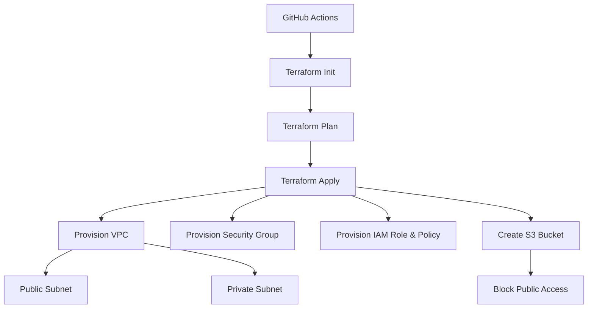

# Terraform AWS Infrastructure with GitHub Actions CI/CD 🚀

This project automates the deployment of foundational AWS infrastructure using Terraform, with a CI/CD pipeline powered by GitHub Actions. 
Changes to the main branch automatically trigger the provisioning or updating of resources.

---

## 🚀 Infrastructure Overview

The Terraform configuration provisions:

- **Custom VPC** with:
  - 1 Public Subnet
  - 1 Private Subnet
- **IAM Role** with full S3 access
- **IAM Policy** attachment
- **S3 Bucket** with strict public access block
- **Security Group** allowing HTTP inbound traffic (port 80)

---

## 🛠 Architecture Diagram


#  GitHub Actions CI/CD Workflow
This project uses GitHub Actions to automate:

- Checkout Repository
- Install Terraform
- Initialize Terraform (`terraform init`)
- Plan Infrastructure Changes (`terraform plan`)
- Apply Changes (`terraform apply`)

# Example of main.tf file 
```
terraform {
  required_providers {
    aws = {
      source  = "hashicorp/aws"
      version = "~> 5.0"
    }
  }
}

provider "aws" {
  region  = "us-east-1"
  profile = "default"
}

resource "aws_vpc" "my_vpc" {
  cidr_block = "10.0.0.0/16"
}

resource "aws_subnet" "public_subnet" {
  vpc_id            = aws_vpc.my_vpc.id
  cidr_block        = "10.0.1.0/24"
  map_public_ip_on_launch = true
}

resource "aws_subnet" "private_subnet" {
  vpc_id     = aws_vpc.my_vpc.id
  cidr_block = "10.0.2.0/24"
}

resource "aws_s3_bucket" "my_bucket" {
  bucket = "moe-terraform-bucket"
}

resource "aws_iam_role" "s3_access_role" { ... }
resource "aws_iam_policy" "s3_access_policy" { ... }
resource "aws_iam_policy_attachment" "attach_s3_policy" { ... }
resource "aws_security_group" "public_sg" { ... }
```

# Security Best Practices
- S3 Public Access is completely blocked.
- IAM Role and Policy grant only the needed permissions.
- Security Group restricts inbound traffic to port 80 (HTTP).

# Requirements
- Terraform (v1.3.6 or newer)
- AWS Account credentials set via GitHub Secrets:
- AWS_ACCESS_KEY_ID
- AWS_SECRET_ACCESS_KEY
- AWS_DEFAULT_REGION

# Setup Instructions
- Clone this repository.
- Set GitHub repository secrets for AWS credentials.
- Push changes to the main branch.
- GitHub Actions automatically provisions the infrastructure.

# Troubleshooting
- Confirm AWS credentials are valid.
- Ensure your Terraform version is compatible (>=1.3.6).
- Validate that bucket names are unique globally (S3).
- Check GitHub Actions logs for debugging.

# Outputs (Optional Enhancements)
You can extend main.tf to output useful values like VPC ID, Subnet IDs, or Bucket ARN:
```
output "vpc_id" {
  value = aws_vpc.my_vpc.id
}

output "public_subnet_id" {
  value = aws_subnet.public_subnet.id
}

output "s3_bucket_name" {
  value = aws_s3_bucket.my_bucket.bucket
}
```
# Setup & Deployment

# Install Terraform
Download Terraform from [Terraform Official Website](https://developer.hashicorp.com/terraform/downloads).

# Clone the Repository

`git clone https://github.com/<your-username>/terraform-aws-automation.git`

`cd terraform-aws-automation`

# Apply Terraform

`terraform init`
`terraform plan`
`terraform apply -auto-approve`

# Save the file 

# Push to GitHub
```sh
git add README.md
git commit -m "Added project documentation"
git push

